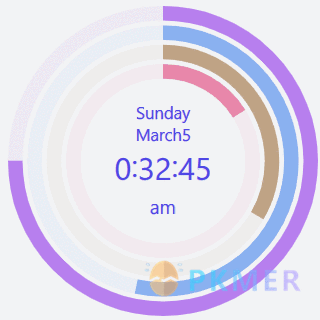

# PKMer 挂件集市

## 介绍

挂件是通过网页嵌入的方式嵌入支持html语法的笔记中，从而达到丰富笔记和美化笔记的作用。

> 说明：
> PKMer 将其部署在 CDN 上，以便您轻松的集成到笔记软件中。因此，PKMer 网站上的挂件是收费的，一方面是对网站成本的付出，另一方面是对PKMer组织的赞助。当然，您可以 fork 该项目到自己项目进行自部署。
> 其次，PKMer 的挂件来源于网络，对其进行了重构或者样式复刻。大部分挂件来自于[codepen](https://codepen.io)，里面有非常多的样例。



## 使用

**方式一：PKMer网站**

[PKMer 挂件集市](https://pkmer.cn/products/widget/widgetMarket/)部署了一份可调的挂件市场，您可以轻松的点击修改样式并生成链接嵌入到笔记中。

**方式二：自部署**

自部署后您可以根据您的域名如`https://xxx.cn`，按挂件路径构造对应链接。如多彩时钟文件夹路径为`pages/pro/ColorfulClock.vue`，则对应的访问链接为`https://xxx.cn/pro/ColorfulClock`。

最后，用html的iframe语法嵌入即可`<iframe src="https://xxx.cn/pro/ColorfulClock" style="width:800px;height:1000px"></iframe>`

## 参与贡献

**安装依赖**

```bash
# pnpm
pnpm install
```

**进行开发**

```bash
# npm
npm run dev
```

**打包**

```bash
# npm
npm run build

```

**生成静态**
```bash
# pnpm
npm run generate
```

**预览**

```bash
# pnpm
pnpm run preview
```


**部署**

复制打包后的 dist 目录到 Nginx 目录文件夹部署就可以了。

## 自部署

`App.vue`文件改成如下文件，去除验证即可：

```js
<script lang="ts" setup>
</script>

<template>
    <NuxtPage />
</template>
```
其余操作和安装依赖，打包，发布一致。